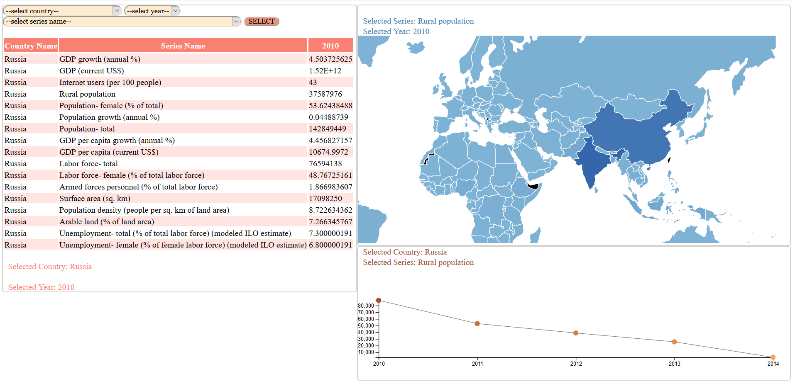
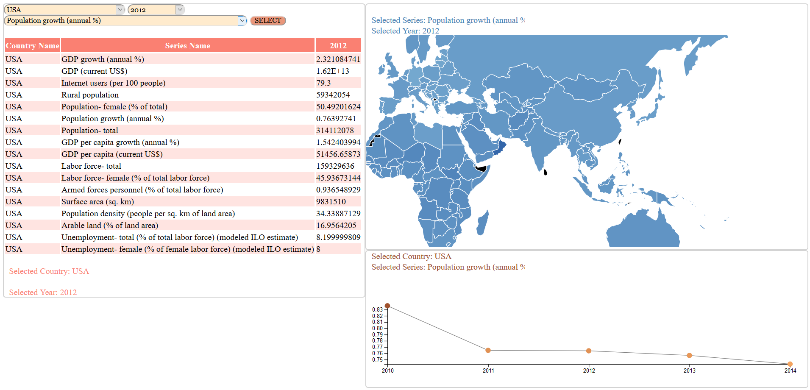
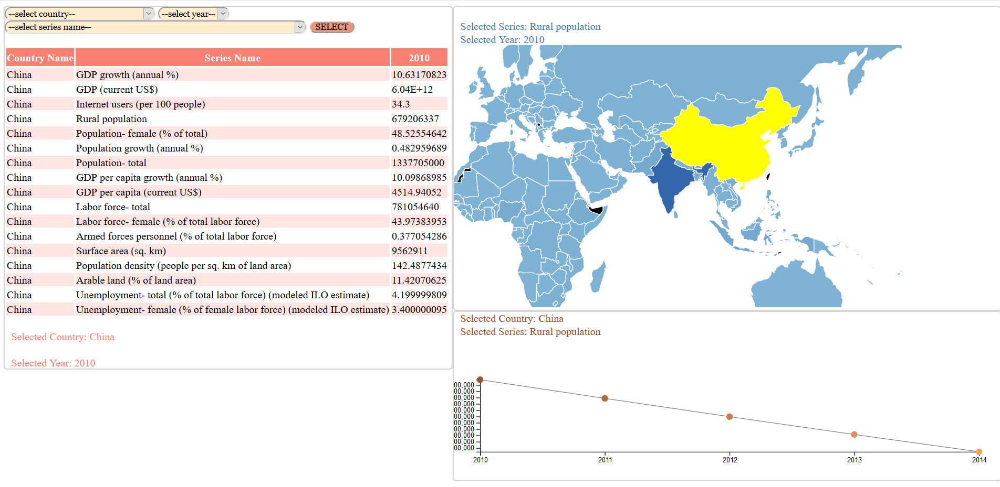
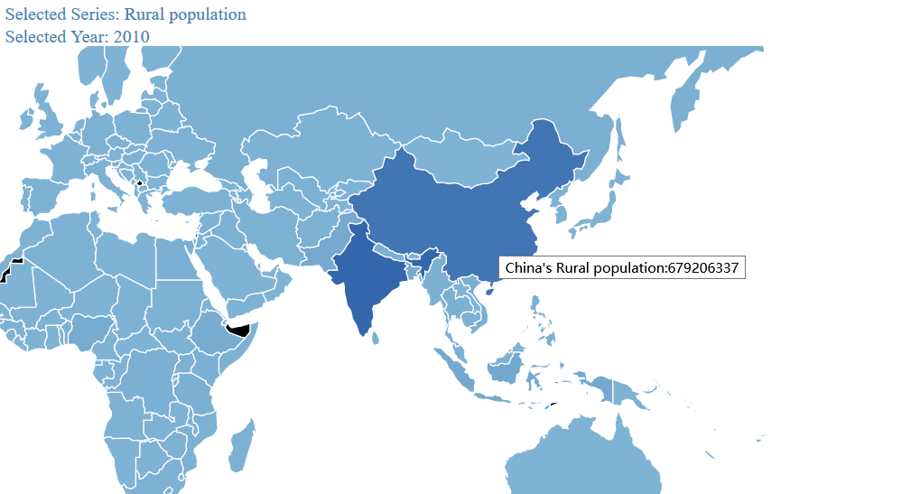
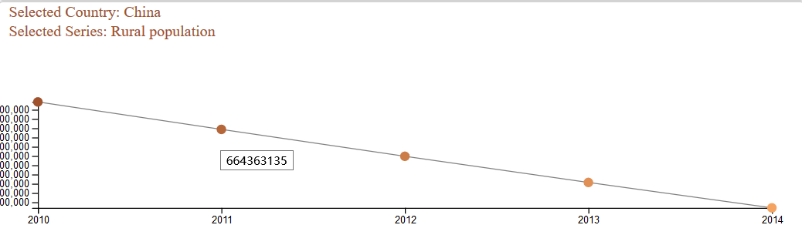
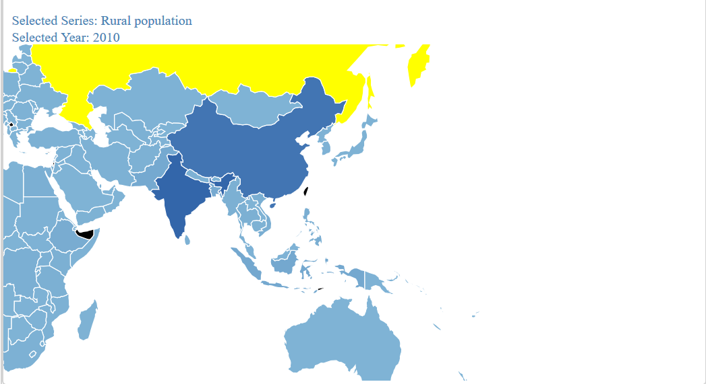
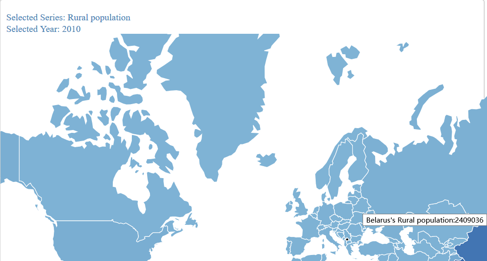
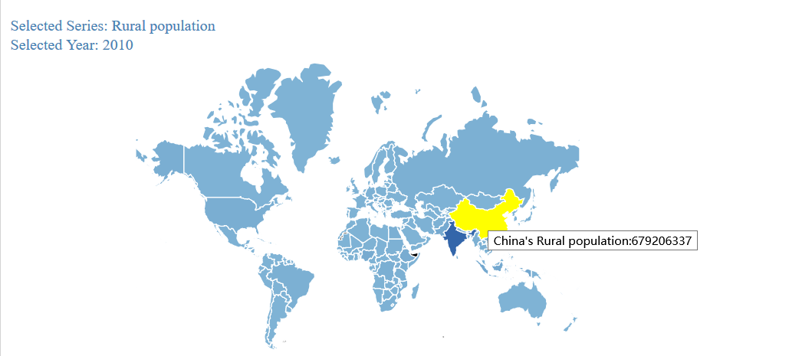
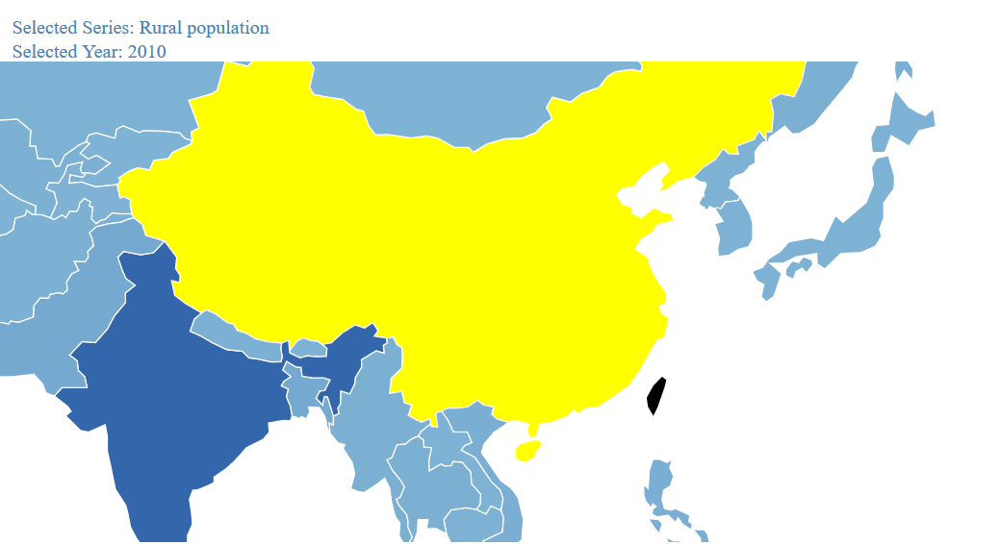

    <h1>
    Homework 6 联动数据可视化
	</h1>

	<h4>
    徐佳怡		 516021910396
	</h4>

<h3>
    1. 页面简介：
</h3>

我制作的国家数据可视化网页默认页面如下：

左上侧是国家，年份，指标选择框；左下侧是数据表格展示区；右上方是地图，颜色的深浅表示数据的大小；右下方是折线图。

整体的数据可视化逻辑是：表格展现一个国家某一年份所有指标的详细数据，地图展现选定国家在选定指标和选定年份上与其他国家的横向对比，折线图展现选定国家在选定指标上与其他年份的纵向对比。

在选定国家，年份，指标后，按 “SELECT”按钮，表格，地图和折线图都会相应变动。

点击地图中某一国家，选定国家会发生改变，从而改变表格与折线图的内容。

<h3>
    2. 交互与联动
</h3>

1. 地图在鼠标移动过程中会有动态变色效果。

   

   
   

2. 鼠标停留在地图某一国家，会显示该国家的数据类型和数据详情。

3. 鼠标停留在折线图某一点上，会显示该年份的数据详情。

   

   
   

4. 对地图能进行拖动操作

   

   
   
   

5. 对地图能进行缩放操作。

   

   
   
   

6. 地图与表格和折线图的联动已经在第一部分叙述。

<h3>
    3. 可视化工具分析
</h3>

我将数据从国家，年份，指标三个维度展开，比较全面。既能横向比较各个国家在同一年份同一指标上的数据，也能纵向比较某一国家在同一指标上不同年份的数据。

因为国家很多，所以在国家这个维度上数据规模较大，一般的图表形式很难让人对数据有直观的感受，因此需要使用地图。因为指标和年份维度上数据类型并不多，采用简单的图标类型就行。

因为所给数据都是数值型数据，所以颜色深浅，柱状图高低，折线图走势都是适合描述数据的工具。我的页面一大缺陷是没能展现数据之间的相关性。

<h3>
    4. 可视化结论
</h3>

1. 中国每一百人中的网络使用者相比欧洲来说偏低，中国的农村人口人数远超世界其他国家。这两个数据之间存在一定相关性，说明中国虽然正在迅猛发展，却还未达到发达国家水平。
2. 中国的GDP逐年稳定增长，GDP增长率略有下滑。说明中国经济继续在发展，国家制定中高速GDP健康增长政策实施很到位。
3. 非洲的整体失业水平和女性事业水平都远高于世界其他国家，非洲人民生活依旧艰苦，依旧需要慷慨的中国政府和人民援助他们。
4. 中国的劳动人口远远超过其他国家，这为中国的崛起和发展提供了巨大的劳动力支持。
5. 欧洲，美国和澳洲的人均GDP高于世界其他国家，不愧是发达国家。
6. 就GDP涨幅来看，美国已经不能与中国相提并论了，难怪最近美国的危机感有点重。巴西，阿根廷，非洲国家的年GDP涨幅也都很大，发展中国家纷纷发展起来了。

